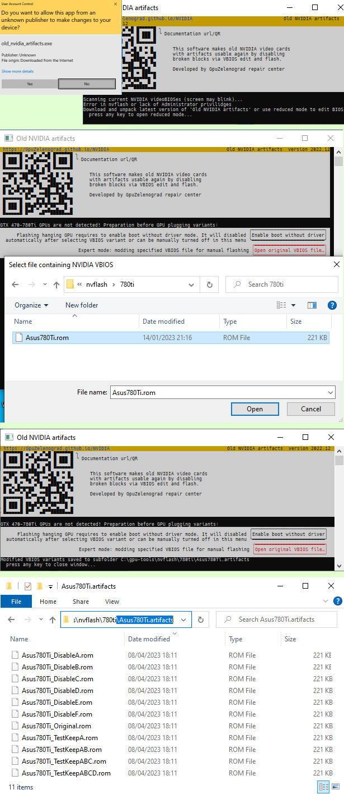

This page describes the non-automated mode of the "Old NVIDIA artifacts" utility; if you are not sure - the [standard user manual](https://gpuzelenograd.github.io/NVIDIA?E) is enough for most scenarios

The non-automated mode performs generating modified variants of the given VBIOS file without flashing or any other communication with real hardware. It is a bit more time-consuming and mostly intended to avoid running the utility on a real hardware with problematic GPU installed - security reasons, 32-bit or outdated OS, etc. Here are the steps to use non-automated mode:

* Use any source for getting the original VBIOS of your problematic GPU as a file. You can use NVFlash, hardware programmer for 3.3V SPI or just [find the VBIOS on TechPowerUp](https://www.techpowerup.com/vgabios/?architecture=NVIDIA&interface=PCI-E&memType=GDDR5)
* Run the "Old NVIDIA artifacts" utility in a 64-bit environment; even a restricted virtual machine would be fine, since there is really no any requirements apart from access to the original VBIOS file.
  * for Linux use non-root account inside desktop environment providing XDG Desktop Portal file dialogs
* There is NO need to allow admin rights for non-automated mode:
  * for Windows, click "No" in elevation confirmation dialog
  * for Linux, press Enter several times instead of entering password on sudo prompt
  * then press any key, acknowledging that you understand the no GPUs were detected due to lack of admin rights; it is fine, since only the VBIOS files are going to be accessed
* Click the "Open original VBIOS file…" button and select original VBIOS file
* The utility will create a folder containing several modified variants of a VBIOS and print the folder name on the output; use your file manager to look on the created files. The files are named according to the memory channels disabled. The utility doesn't know actual memory channel count for the GPU, so it will generate variants that disable channels from A to F for all GPUs, including 2- and 4-channel models; disabling such non-existing channels has no any effect
* Get NVFlash utility that can flash your GPU on the target PC. The GM107-based GPUs requires the ["Certificate checks bypassed" variant hosted on TechPowerUp](https://www.techpowerup.com/download/nvidia-nvflash-with-certificate-checks-bypassed/)
  * You may use hardware programmer for 3.3V SPI if you prefer
* Flash VBIOS variants with different channels disabled - one of them may help your GPU!

Most of the mentioned steps are pictured below

{: style="text-align: center;"}