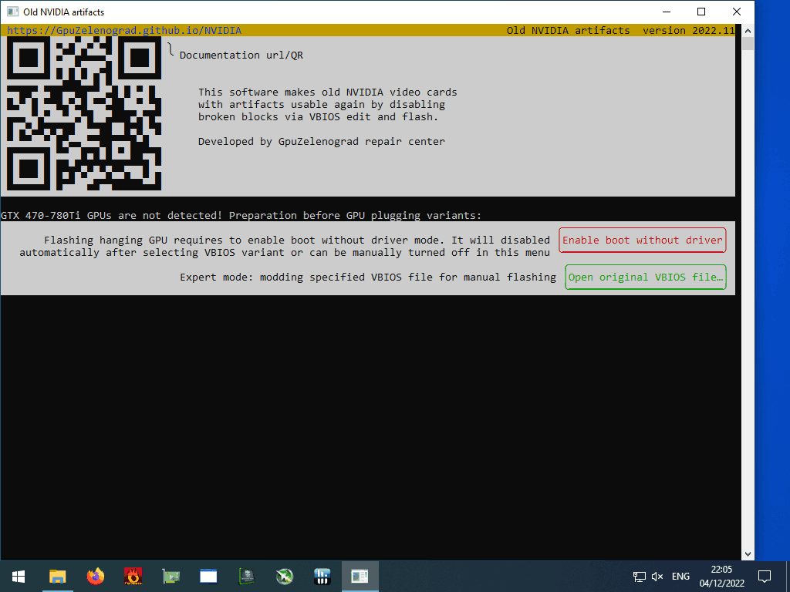
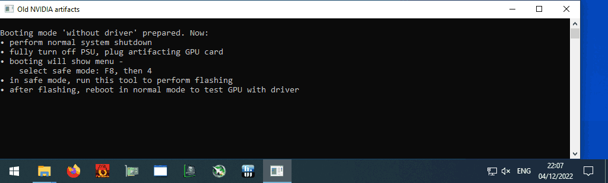

 

# [🗄️Windows 64-bit (4MB zip)](https://gpuzelenograd.github.io/releases/empty.zip)
# [🐧Linux (4MB tar.xz)](https://gpuzelenograd.github.io/releases/empty.tar.xz)

 
 
 

# User manual

Some preparations need to be done before first plug of artifacting GPU, because otherwise OS may hang during boot. A [special boot mode](#bootmode) need to be enabled, it will allow selecting each time between normal and safe-mode driverless boot.

To enable it, start the "Old NVIDIA artifacts" tool while problematic GPU is not plugged yet, and press "Enable boot without driver" button (it can be under "Prepare without GPU…" submenu)

After enabling driverless boot mode, the instruction for plugging problematic GPU would be shown

See [Troubleshooting section](#troubleshooting) if you can't boot OS even without driver while problematic card is plugged in.

## Stage1 - test VBIOS flash

## Stage2 - more VBIOS flashes

## Completion
... more details under construction, [some more screenshots here](https://gpuzelenograd.github.io/NVIDIARU.html?user_manual&noredirect)

### <a id="bootmode">Special boot mode</a>
The special boot mode button just tunes built-in OS functionality. Mode can be switched back to normal in 4 ways:
* automatically during completion stage after the VBIOS search is done
* manually via the "Disable boot without driver" button
* manually by running `restore_boot_mode` tool from detail subfolder
* manually by running `bcdedit /set "{bootmgr}" displaybootmenu no` (or `systemctl set-default graphical.target` for Linux)

### <a id="troubleshooting">Troubleshooting</a>
Many problematic GPUs can hang booting even during POST, before OS load. Some of such cards are fixable too, but may require several workarounds to be able to boot the OS and be flashed with the "Old NVIDIA artifacts tool". Try the following:
* enable/disable CSM-compatible-with-non-EFI mode in motherboard BIOS
* enable "Integrated GPU" or "iGPU Multi-Monitor" in motherboard BIOS and attach display to the motherboard
* use two discrete GPUs: plug the working GPU with display attached into the PCIe slot closest to CPU and plug the problematic card in another slot.