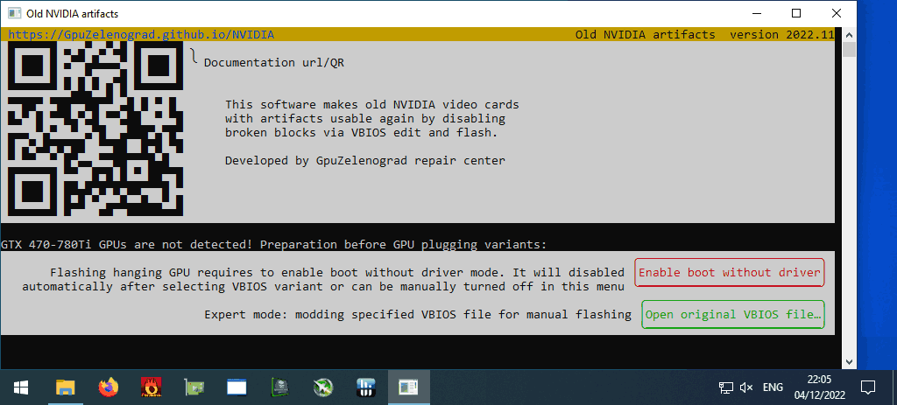
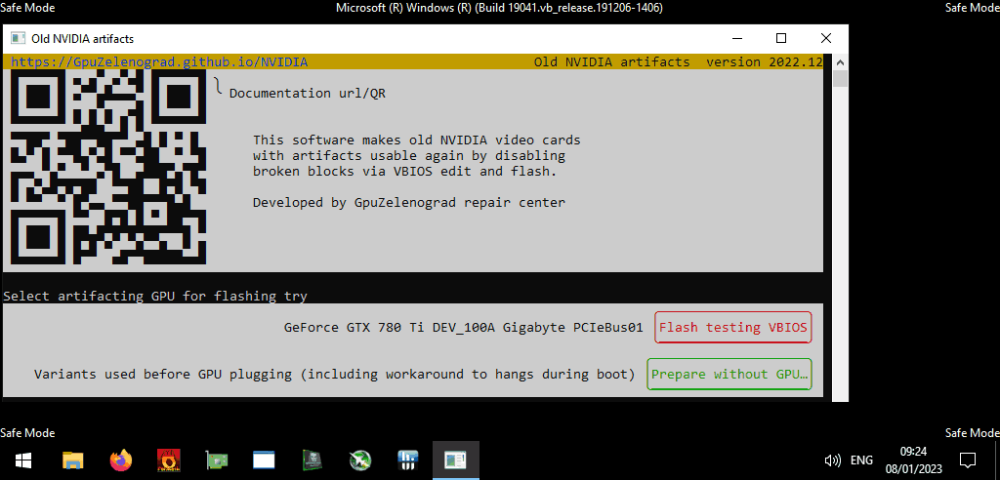
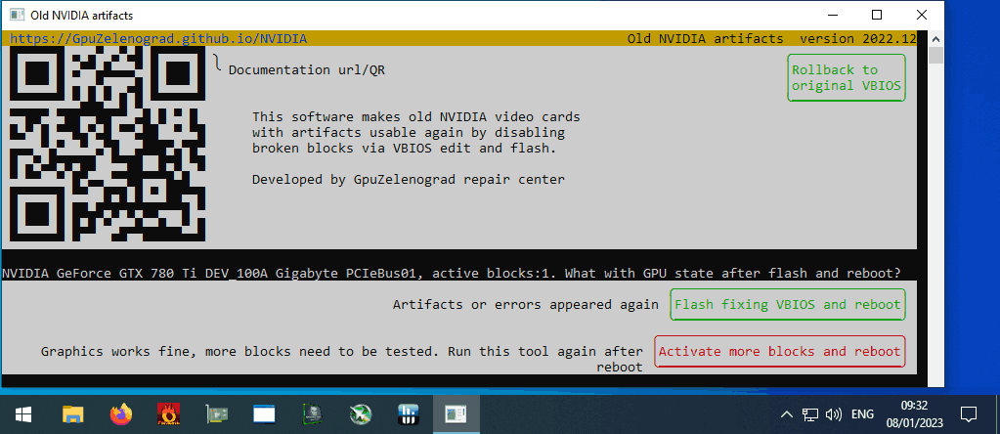
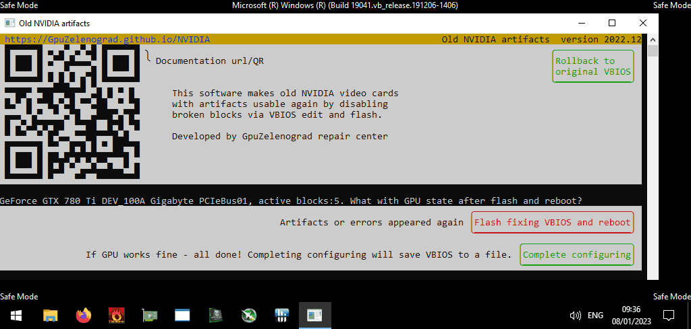
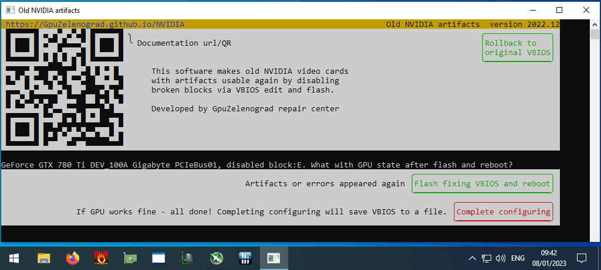

Fix GPU artifacting for some GTX 470-780Ti: disable bad blocks by the "Old NVIDIA artifacts **2022.12**" utility
 

### [<big><big>**🗄️Windows 7-10 64-bit&nbsp;**</big></big> 4MB zip, GTX 470-780Ti](https://gpuzelenograd.github.io/releases/Windows_old_nvidia_artifacts-2022.12.zip)
### [<big><big>**🐧Linux&nbsp;**</big></big> 4MB tar.xz, GTX <i>645</i>-780Ti](https://gpuzelenograd.github.io/releases/Linux_old_nvidia_artifacts-2022.12.tar.xz)
 
 
Thanks to all researchers of modded BIOSes, such files were very helpful during development!
 
[Changelog and older versions](#changelog)
 

# User manual

Some preparations need to be done before first plug of artifacting GPU, because otherwise OS may hang during boot. Start the "Old NVIDIA artifacts" tool while problematic GPU is not plugged yet, and press "Enable boot without driver" button, it can be under "Prepare without GPU" submenu. This enables [the special boot mode](#bootmode), that allows selecting each time between normal and safe-mode driverless boot.

After enabling driverless boot mode, the instruction for plugging problematic GPU would be shown

See [Troubleshooting section](#troubleshooting) if you can't boot OS even without driver while problematic card is plugged in.

## Stage1 - initial VBIOS flash

## Stage2 - more VBIOS flashes

## Completion

### <a id="bootmode">Special boot mode</a>
The special boot mode button just tunes built-in OS functionality. Mode can be switched back to normal in several ways:
* automatically during completion stage after the VBIOS search is done
* manually via the "Disable boot without driver" button
* manually by launching as Administrator `restore_boot_mode` tool from detail subfolder
* manually by running as Administrator `bcdedit /set "{bootmgr}" displaybootmenu no` (for Linux: `systemctl set-default graphical.target`)

### <a id="troubleshooting">Troubleshooting</a>
Many problematic GPUs can hang booting even during POST, before OS load. Some of such cards are fixable too, but may require several workarounds to be able to boot the OS and be flashed with the "Old NVIDIA artifacts" tool. Try the following:
* enable/disable CSM-compatible-with-non-EFI mode in motherboard BIOS
* enable "Integrated GPU" or "iGPU Multi-Monitor" in motherboard BIOS and attach display to the motherboard
* use two discrete GPUs: plug the working GPU with display attached into the PCIe slot closest to CPU and plug the problematic card in another slot.

### <a id="changelog">Changelog and older versions</a>

Version 2022.12 improvements:
  * fixed running on Windows 7
  * fixed flashing GTX750Ti Asus DirectCU II, GTX760 Asus DirectCU II and some others
  * generating modded VBIOSes from a given file can be done without admin rights

#### 2022.11 downloads
  * [Windows <i>8</i>-10 64-bit 4MB zip, GTX 470-780Ti](https://gpuzelenograd.github.io/releases/Windows_old_nvidia_artifacts-2022.11.zip)
  * [Linux 4MB tar.xz, GTX <i>645</i>-780Ti](https://gpuzelenograd.github.io/releases/Linux_old_nvidia_artifacts-2022.11.tar.xz)
