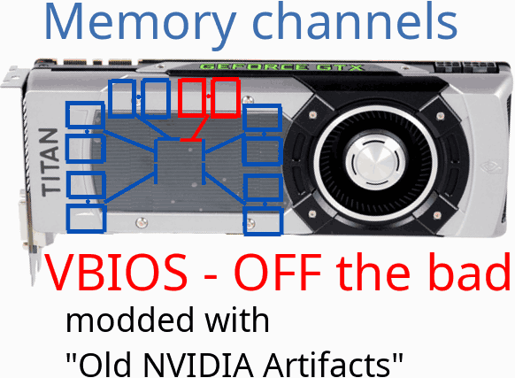

[&nbsp;&nbsp;&nbsp;`🌐中文`](https://www.chinafix.com/thread-1335463-1-1.html){: style="float: right"}
Old NVIDIA artifacts **2022.12** disables bad blocks to fix GPU artifacting. Download:
 

### [<big><big>**Windows 7-11 64-bit**</big></big>🗄️4MB zip, GTX470-780Ti](https://gpuzelenograd.github.io/releases/Windows_old_nvidia_artifacts-2022.12.zip)
{: style="float: right; width: 42%;"}
### [<big><big>**Linux**</big></big>🐧4MB tar.xz, GTX645-780Ti](https://gpuzelenograd.github.io/releases/Linux_old_nvidia_artifacts-2022.12.tar.xz)

 
Old NVIDIA artifacts utility works with Fermi, Kepler and 750Ti GPUs. It can fix some artifacting/Code 43 GPUs by flashing VBIOS that disable malfunctioning GPU parts. Fixed GPUs can be used in any computer. GTX Titan 6GB is also supported
 
 
[Changelog and misc downloads](#changelog)
 
Discussion area: [Reddit](https://www.reddit.com/r/GPURepair/comments/11bzn63/nvidia_470780_vbios_mod_fix_artifactscode_43_by/)
  
Thanks to all researchers for modded BIOSes, they were very helpful during development!
 

## User manual
The steps below represent a typical use of the utility, and due to the semi-automatic flashing, it takes only ~15 minutes. For experts, there is a [non-automated mode for VBIOS modification](https://gpuzelenograd.github.io/EXPERT)

Prepare your system for malfunctioning GPU, otherwise your system may hang during OS boot:  start the utility while faulty GPU is not plugged yet

* click "Enable boot without driver" ([special boot mode](#bootmode) where you can select between regular boot and safe mode without video driver)
* follow instructions on your screen

if you can't boot your system with faulty GPU even in safe mode, then check [Troubleshooting](#troubleshootingsect)

## First flash
Click "Flash testing VBIOS"

Original VBIOS automatically got saved at this point, click "Reboot"

## Next flashes
If the system boots fine and there are NO artifacts on the screen:
* install compatible NVIDIA driver, like 390/391.xx
* run any *short* benchmark
* start the utility again, select "Activate more blocks and reboot"

If there are artifacts or boot/benchmark problems – select "Flash fixing VBIOS and reboot"

Continue until the utility will find an optimal and stable VBIOS. If your GPU still shows some artifacts, then it can not be fixed by this utility.

## Last stage
If the utility have found optimal and stable VBIOS and GPU have completed any benchmark – start the utility and select "Complete configuring", this will save modified VBIOS and return your system to normal boot mode

You can run GPU-Z and check your current "bus width" and "memory size"

### Performance
If modification succeeds, the GPU memory size and bus width reduces. For GPUs with only 4 memory chips the performance drop is significant, but for cards with a lot of chips the difference is quite small.

The standard 3GB 384bit [780Ti GHz Edition](https://www.techpowerup.com/gpu-specs/gigabyte-gtx-780-ti-ghz-edition.b2682) on average achieves [3700 Graphics score](https://www.3dmark.com/search#advanced?test=spy%20P&cpuId=&gpuId=908&gpuCount=1&gpuType=ALL&deviceType=ALL&storageModel=ALL&memoryChannels=0&country=&scoreType=overallScore&hofMode=false&showInvalidResults=false&freeParams=&startDate=2017-01-01&endDate=2100-01-01&minGpuCoreClock=1150&maxGpuCoreClock=1340&minGpuMemClock=&maxGpuMemClock=&minCpuClock=&maxCpuClock=) in the TimeSpy benchmark. And here are results for fixed 780Ti with 320bit bus left, and a SLIed pair of such cards:

[**Single** 780Ti 2.5GB GHz Edition](https://www.3dmark.com/3dm/88862792)[**SLI 2×**780Ti 2.5GB](https://www.3dmark.com/3dm/88861601)
{: style="column-count:2;text-align: left;"}

### <a id="bootmode">Special boot mode</a>
"Enable boot without driver" button just tunes built-in OS functionality to let you enter safe mode without video driver. To reverse it, try one of this:
* successfully complete VBIOS modification (will be applied automatically)
* manually via the "Disable boot without driver" button
* manually by launching as Administrator `restore_boot_mode` tool from detail subfolder
* manually by running as Administrator `bcdedit /set "{bootmgr}" displaybootmenu no` (for Linux: `systemctl set-default graphical.target`)

### <a id="troubleshootingsect">Troubleshooting</a>
Some of faulty GPUs may hang even during POST and don't make it to safe mode. Part of them *can* be fixed, but may require several workarounds to be able to boot the OS and be flashed with the "Old NVIDIA artifacts" tool. On some computers, after 1 minute of a black screen, the monitor will turn on and the system will continue to boot. If it doesn't, try the following options:
* boot with problematic GPU unplugged and enable/disable "CSM compatible" (non-EFI) mode in motherboard BIOS. Save settings, power off and plug the GPU again
* boot with problematic GPU unplugged and enable "Integrated GPU" or "iGPU Multi-Monitor" in motherboard BIOS. Save settings, power off and plug the GPU again, but leave the display attached to the motherboard
* use two discrete GPUs: plug the working GPU with display attached into the PCIe slot closest to CPU, and plug the faulty card in another slot.

Several Asus models report `Error: Selected GPU doesn't support flashing modified VBIOS`. For part of them, this can be resolved from console:
* Open command line window as Administrator
* `cd` to the "detail" subfolder with "nvflash" executable
* run command to make VBIOS writable: `nvflash --protectoff`

Older GPU models like Fermi-based GTX470-590 and [Kepler-based Grid](https://gpuzelenograd.github.io/photo/GridK2-Fixed.png) cards uses older NVIDIA 3xx drivers and are supported only by Windows version, not the Linux one.

### <a id="changelog">Changelog and misc downloads</a>

[Version 2022.12](#top) improvements:
  * now works on Windows7 (Windows10-11 as well)
  * fixed flashing GTX750Ti Asus DirectCU II, GTX760 Asus DirectCU II and some others
  * generating modded VBIOSes from a given file can be done without admin rights

#### Older 2022.11 downloads
  * [Windows <i>8</i>-10 64-bit 4MB zip, GTX 470-780Ti](https://gpuzelenograd.github.io/releases/Windows_old_nvidia_artifacts-2022.11.zip)
  * [Linux 4MB tar.xz, GTX <i>645</i>-780Ti](https://gpuzelenograd.github.io/releases/Linux_old_nvidia_artifacts-2022.11.tar.xz)

#### Misc
  * [modified VBIOS variants for reference edition GTX Titan 6GB](https://gpuzelenograd.github.io/releases/NVIDIA-GTX-Titan-6GB_Disable.zip)

[*Translations of this guide are welcome*](https://github.com/GpuZelenograd/GpuZelenograd.github.io/blob/master/NVIDIAtranslating)
{: style="text-align: right;"}