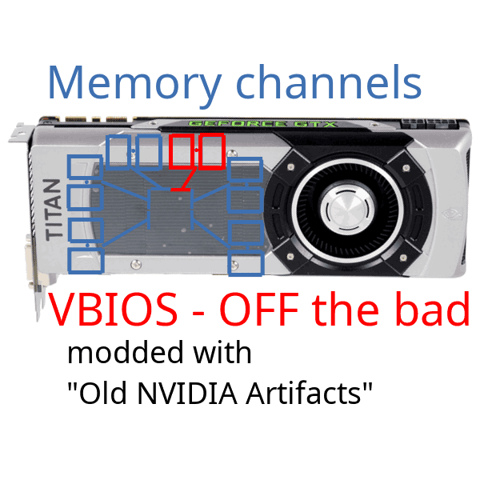
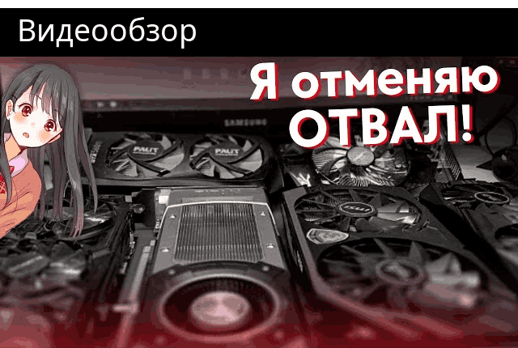
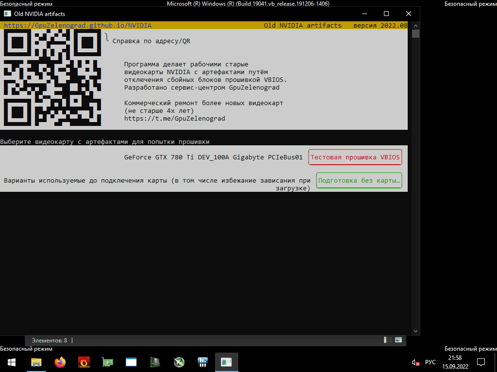
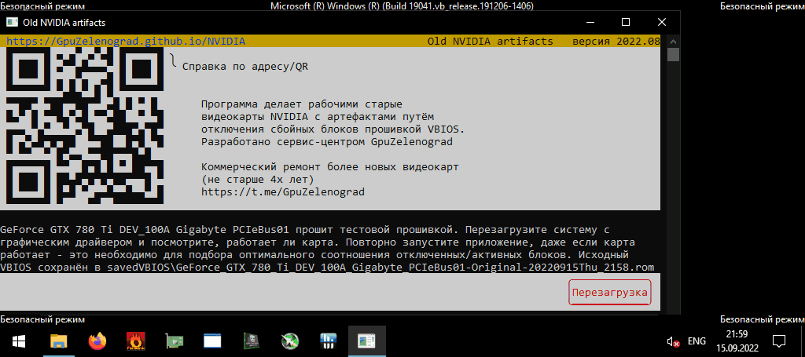
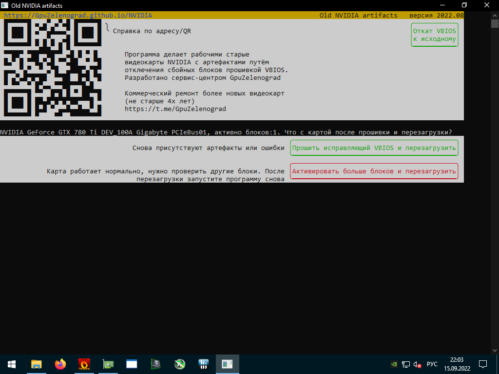
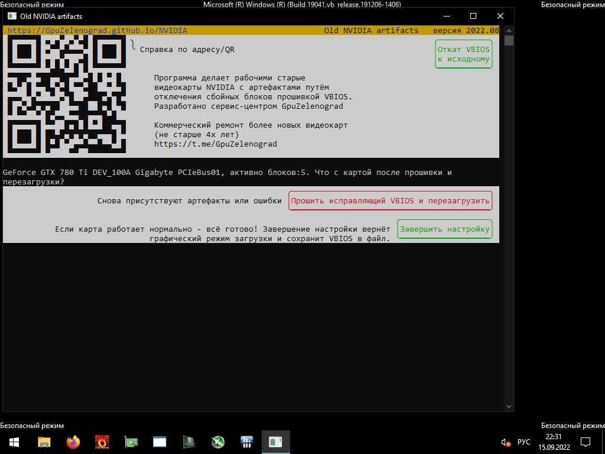
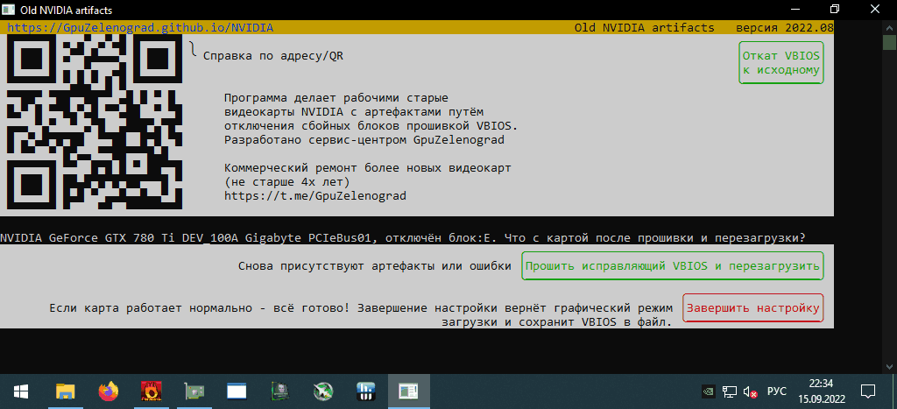
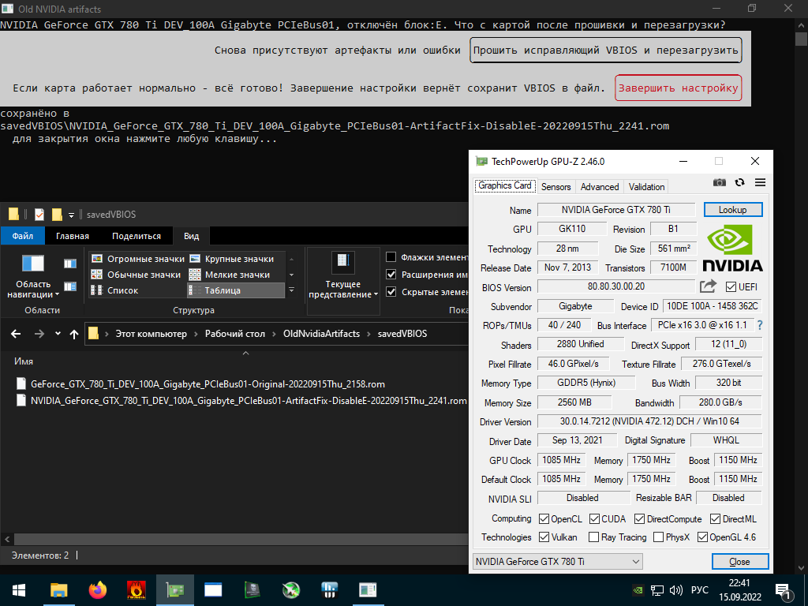

[&nbsp;&nbsp;&nbsp;`🌐En`](https://gpuzelenograd.github.io/NVIDIA?noredirecten){: style="float: right"}
Old NVIDIA artifacts **2022.12** отключает сбойные блоки GPU. Скачать:
 

### [<big><big>**Windows 7-10 64-bit**</big></big>🗄️4MB zip, GTX470-780Ti](https://gpuzelenograd.github.io/releases/Windows_old_nvidia_artifacts-2022.12.zip)
{: style="float: right; width: 42%;"}
### [<big><big>**Linux**</big></big>🐧4MB tar.xz, GTX645-780Ti](https://gpuzelenograd.github.io/releases/Linux_old_nvidia_artifacts-2022.12.tar.xz)

 
Утилита Old NVIDIA artifacts работает с видеокартами поколений Fermi, Kepler и 750Ti. Она может исправить некоторые виды артефактов/отвалов, прошивая VBIOS отключающий неисправные блоки. Прошитая видеокарта может использоваться на любом компьютере. Восстановление GTX Titan 6GB также возможно.
 
 
[Список изменений и прочие загрузки](#changelog)
 
 

 

## Руководство пользователя
Перед подключением проблемной видеокарты необходимо подготовиться, иначе загрузка ОС может зависнуть. Для этого запускаем утилиту и нажимаем кнопку «Включить загрузку без драйвера», может быть в подменю «Подготовка без карты». Это включит [специальный режим загрузки](#bootmode), в котором при каждом старте можно выбрать - грузиться как обычно или зайти в безопасный режим без драйвера

После его включения отображается инструкция по первой вставке проблемной карты

Если при подключенной проблемной карте не удаётся загрузить ОС даже без драйвера  - перейдите к разделу [решение проблем](#troubleshootingsect)

## Этап1 - первая прошивка
При первом запуске с воcстанавливаемой картой выполняем тестовую прошивку VBIOS

После первой прошивки нажимаем «Перезагрузка». Исходный VBIOS на всякий случай автоматически сохраняется в файл

## Этап2 - последующие прошивки

После этой и каждой последующей прошивки - необходимо оценить работоспособность карты. При отсутствии артефактов на экране BIOS выбираем обычный запуск с драйвером. Если для видеокарты ещё не стоит драйвер - устанавливаем драйвер NVIDIA 390/391.xx и запускаем какой-нибудь тест. При зависании системы на любом из этапов выполняем перезагрузку в безопасном режиме.

После того как удалось запустить систему - повторно запускаем утилиту и указываем прошла ли карта тест или проблема по-прежнему осталась

После нескольких перезагрузок утилита придёт к финальному решению - предложит завершить настройку на найденном оптимальном варианте, или если карта попрежнему не работает - сообщит что проблема не может быть решена прошивкой. В последнем случае остаётся только выполнить откат VBIOS к исходному соответствующей кнопкой, завершить работу и отключить карту.

## Завершение
Если найден оптимальный вариант прошивки, который работает с драйвером и проходит тест - выбираем "завершить настройку".

При завершении настройки подобранный VBIOS сохранится в файл и вернётся обычный режим загрузки. В GPU-Z будет видна сокращённая шина памяти:

### <a id="bootmode">Специальный режим загрузки</a>
Кнопка «Включить загрузку без драйвера» просто изменяет встроенные настройки ОС. Режим можно переключить обратно в обычный несколькими способами:
* автоматически на этапе завершения после окончания поиска VBIOS
* вручную через кнопку «Отключить загрузку без драйвера»
* вручную, запустив от Администратора сценарий `restore_boot_mode` из подпапки detail
* вручную, выполнив от Администратора команду `bcdedit /set "{bootmgr}" displaybootmenu no` (для Linux: `systemctl set-default graphical.target`)

### <a id="troubleshootingsect">Решение проблем</a>
Некоторые проблемные видеокарты могут зависать при загрузке даже во время POST, до загрузки ОС. Часть из таких карт также можно исправить, но для загрузки могут потребоваться различные способы, позволяющие загрузить ОС и выполнить прошивку утилитой «Old NVIDIA artifacts». Попробуйте следующее:
* включить/отключить CSM-compatible-with-non-EFI режим в BIOS материнской платы
* включить «Integrated GPU» или «iGPU Multi-Monitor» в BIOS материнской платы и подключите дисплей к материнской плате
* использовать две дискретных видеокарты: вставьте в ближайший к процессору слот PCIe работающаю видеокарту с подключенным дисплеем, а проблемную карту — в другой слот.

### <a id="changelog">Список изменений и прошлые версии</a>

Улучшения в [версии 2022.12](#top):
  * теперь утилита работает в Windows 7 наравне с Windows 10
  * исправлена прошиваемость GTX750Ti Asus DirectCU II, GTX760 Asus DirectCU II и некоторых других
  * создание вариаций VBIOS из указанного файла может производиться без прав администратора

#### Архивы версии 2022.11
  * [Windows <i>8</i>-10 64-bit 4MB zip, GTX 470-780Ti](https://gpuzelenograd.github.io/releases/Windows_old_nvidia_artifacts-2022.11.zip)
  * [Linux 4MB tar.xz, GTX <i>645</i>-780Ti](https://gpuzelenograd.github.io/releases/Linux_old_nvidia_artifacts-2022.11.tar.xz)

#### Прочее
  * [Архив c вариантами модификаций VBIOS для референсного исполнения GTX Titan 6GB](https://gpuzelenograd.github.io/releases/NVIDIA-GTX-Titan-6GB_Disable.zip)