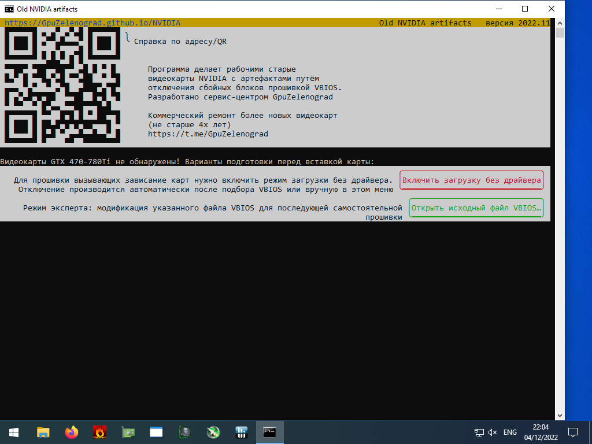
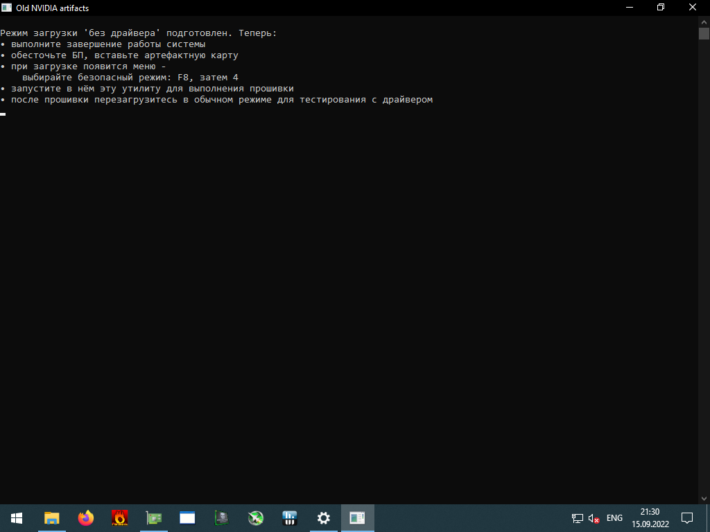

Утилита "Old NVIDIA artifacts" позволяет восстановить некоторые GTX470-780Ti, отключая проблемные блоки
 

# [🗄️Windows 64-bit (4MB zip)](https://gpuzelenograd.github.io/releases/Windows_old_nvidia_artifacts-2022.11.zip)
# [🐧Linux (4MB tar.xz)](https://gpuzelenograd.github.io/releases/Linux_old_nvidia_artifacts-2022.11.tar.xz)

 
 
Видеообзор: 
 

# Руководство пользователя
Перед первой вставкой проблемной видеокарты необходимо выполнить подготовку, поскольку иначе возможны зависания при загрузке ОС. Должен быть включен [специальный режим загрузки](#bootmode), в котором при каждом старте можно выбрать - грузиться как обычно или заходить в безопасный режим без драйвера.

Для этого загружаем систему без проблемной карты, нажимаем кнопку «Включить загрузку без драйвера» (может быть в подменю «Подготовка без карты…»)

После включения режима программа показывает инструкцию по первой вставке проблемной карты

Если при подключенной проблемной карте не удаётся загрузить ОС даже без драйвера  - перейдите к разделу [решение проблем](#troubleshooting), .

## Этап1 - первая прошивка

## Этап2 - последующие прошивки

## Завершение

### <a id="bootmode">Специальный режим загрузки</a>
Кнопка «Включить загрузку без драйвера» просто изменяет встроенные настройки ОС. Режим можно переключить обратно в обычный несколькими способами:
* автоматически на этапе завершения после окончания поиска VBIOS
* вручную через кнопку «Отключить загрузку без драйвера»
* вручную, запустив от Администратора сценарий `restore_boot_mode` из подпапки detail
* вручную, выполнив от Администратора команду `bcdedit /set "{bootmgr}" displaybootmenu no` (для Linux: `systemctl set-default graphical.target`)

### <a id="troubleshooting">Решение проблем</a>
Некоторые проблемные видеокарты могут зависать при загрузке даже во время POST, до загрузки ОС. Часть из таких карт также можно исправить, но для загрузки могут потребоваться различные способы, позволяющие загрузить ОС и выполнить прошивку утилитой «Old NVIDIA artifacts». Попробуйте следующее:
* включить/отключить CSM-compatible-with-non-EFI режим в BIOS материнской платы
* включить «Integrated GPU» или «iGPU Multi-Monitor» в BIOS материнской платы и подключите дисплей к материнской плате
* использовать две дискретных видеокарты: вставьте в ближайший к процессору слот PCIe работающаю видеокарту с подключенным дисплеем, а проблемную карту — в другой слот.
