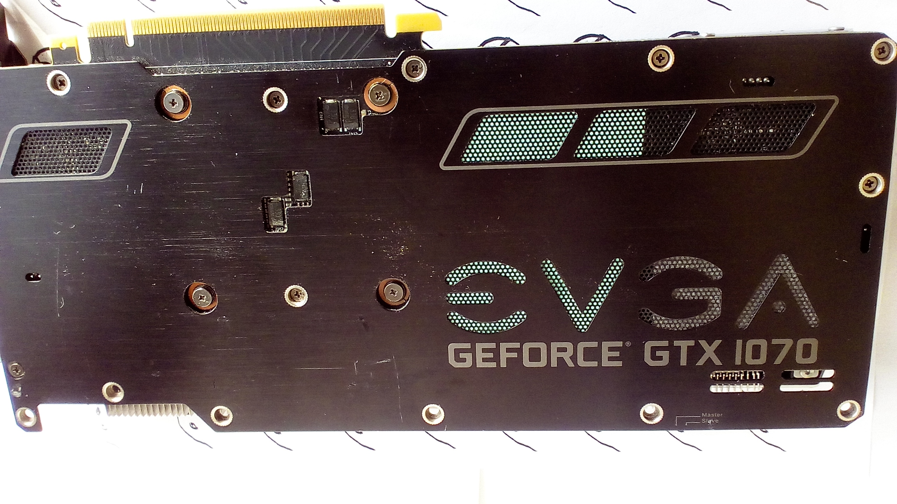
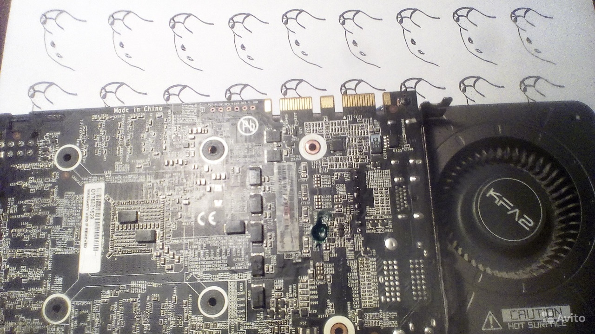
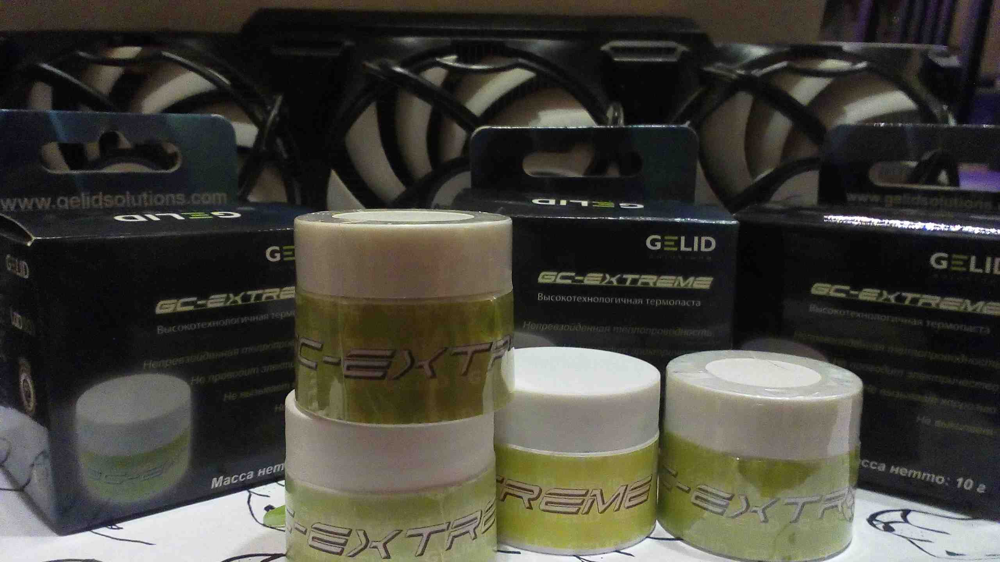

[&nbsp;&nbsp;&nbsp;`🌐En`](https://gpuzelenograd.github.io/README?noredirectfm){: style="float: right"}
## Наши программы и ресурсы для видеокарт
- Простой нагрузочный тест для проверки видеопамяти современных видеокарт [memtest_vulkan (open source)](https://github.com/GpuZelenograd/memtest_vulkan/releases#user-content-Downloads)
- Исправление артефактов/отвала/кода 43 для некоторых старых карт [Old NVIDIA artifacts - GTX470-750/780Ti](https://gpuzelenograd.github.io/NVIDIARU?main)
- [Нюансы по VBIOS старых RX470-580](https://gpuzelenograd.github.io/RX470RU?main)

## Наши ремонты видеокарт

## О нас
Наш сервис находится в 14 мкр-не Зеленограда.

Мы производим ремонт видеокарт с повреждениями разной степени,
например:
- компьютер с ней не включается, бп уходит в защиту
- нет изображения, не определяется
- прогары на плате, в том числе с восстановлением дорог
- отключается в процессе работы
и т.д.

Умеем анализировать плату, благодаря специализации исключительно на видеокартах есть огромный опыт диагностирования сложных случаев; ремонтом другой техники не занимаемся.

Только надёжный ремонт, без "прогрева" и подобного. Гарантия от 3 месяцев. Оплата только в случае успешного ремонта. Стоимость и сроки ремонта определяются после бесплатной диагностики.

Бесплатная замена уставших термопрокладок и обслуживание карты в случае ремонта.

## Контакты
По вопросу ремонта видеокарт или при возникновении гарантийного случая:
- пишите в телеграм [@GpuZelenograd](https://t.me/GpuZelenograd) 
- обращайтесь к нам через
[Avito](https://www.avito.ru/moskva_zelenograd/tovary_dlya_kompyutera/msi_rtx_3070_ventus_3x_oc_garantiya_7928259675)
- звоните по телефону с 10 до 23:

Если объявление о ремонте на Avito неактивно - значит сейчас на ремонт очередь))
